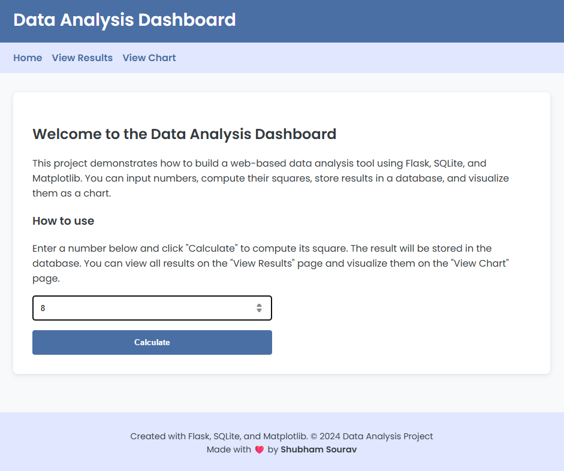
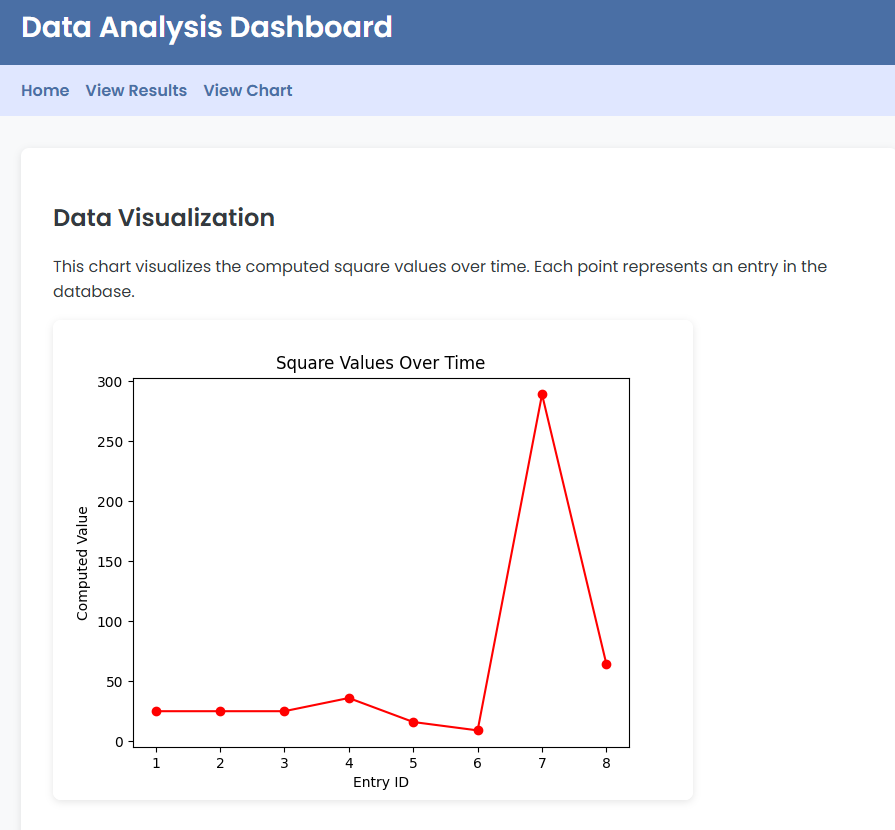
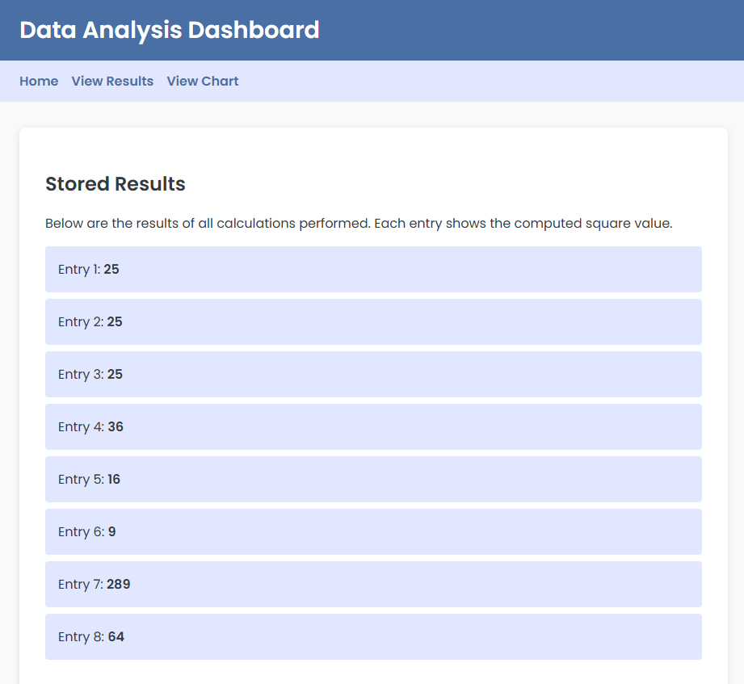

# 📊 NumSquare Dashboard with Flask

This project is a web-based data analysis dashboard built using **Flask**, **SQLite**, and **Matplotlib**.  
It allows users to input numbers, compute their squares, store the results in a database, and visualize the trends over time.

---

## 🚀 Features

- 📥 Input numbers via a form
- 🧮 Automatically compute their square values
- 🗃️ Store computed values in an SQLite database
- 📃 View all entries in a result list
- 📈 Visualize results using Matplotlib chart
- 🔁 Automatic redirect to results after submission

---

## 📸 Screenshots

### 🏠 Home Page – Enter a Number


### 📈 Chart Page – Visualize Square Trends


### 📋 Results Page – See Stored Values


---

## 📁 Project Structure

```
flask_data_analysis/
├── app.py
├── instance/
│   └── data.db
├── templates/
│   ├── base.html
│   ├── chart.html
│   ├── index.html
│   └── results.html
├── venv/
├── .gitignore
├── requirements.txt
└── README.md
```

---

## 🛠️ Getting Started

### 1. Clone this repository

```bash
git clone https://github.com/yourusername/flask_data_analysis.git
cd flask_data_analysis
```

### 2. Create & activate virtual environment

```bash
python -m venv venv
```

On **Windows**:
```bash
venv\Scripts\activate
```

On **macOS/Linux**:
```bash
source venv/bin/activate
```

### 3. Install required libraries

```bash
pip install -r requirements.txt
```

### 4. Initialize the database

```bash
python
>>> from app import app, db
>>> with app.app_context():
>>>     db.create_all()
>>> exit()
```

### 5. Run the application

```bash
python app.py
```

Visit [http://127.0.0.1:5000](http://127.0.0.1:5000) in your browser.

---

## 🔗 Routes Summary

| Route         | Description                          |
|---------------|--------------------------------------|
| `/`           | Home page – input number             |
| `/square`     | POST handler to compute square       |
| `/results`    | View all results stored in DB        |
| `/chart`      | View line chart of square values     |

---

## 🧑‍💻 Made With

- Flask
- Flask-SQLAlchemy
- Matplotlib
- HTML + Jinja2

---

## 📜 License

This project is licensed under the **MIT License**.

---

## ✍️ Author

**Shubham Sourav**  
*Data Science Enthusiast | Python Developer*

